# Step 4

Create Account to [MongoDB](https://www.mongodb.com/)

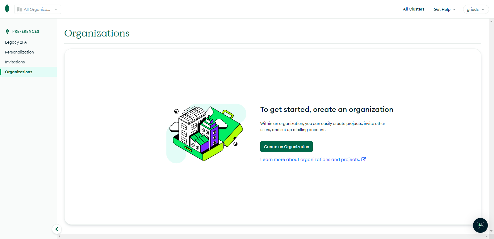

create an organization

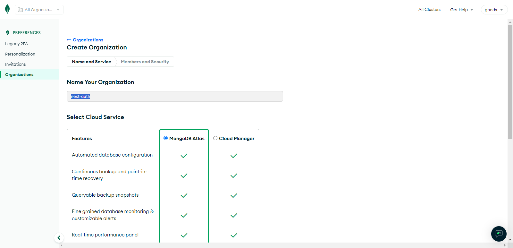

Name Your Organization and Click to Button >> Next

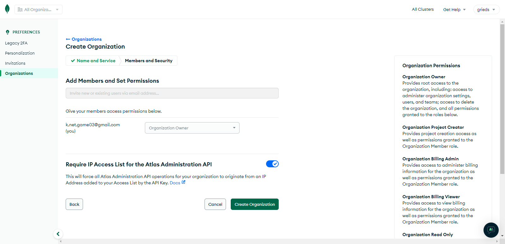

Click to Button >> Create Organization

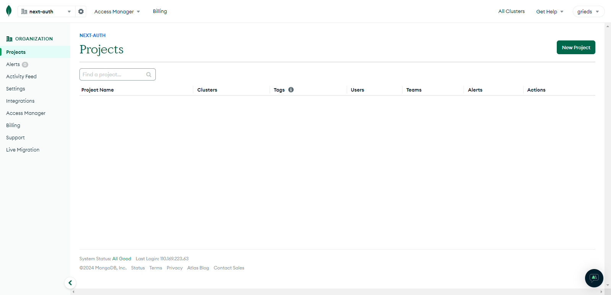

Click to Button >> New Project

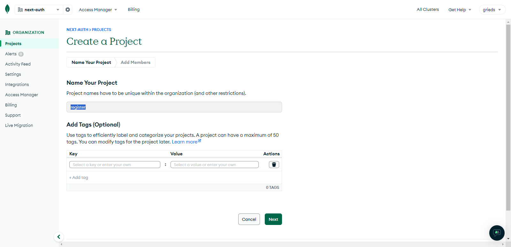

Name Your Project and Click to Button >> Next

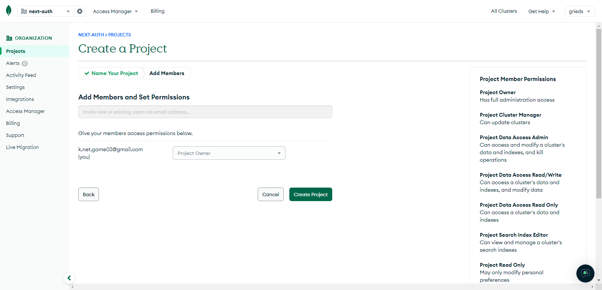

Click to Button >> Create Project

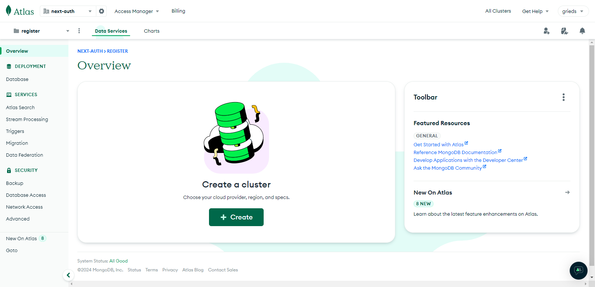

Click to Button >> Create a cluster

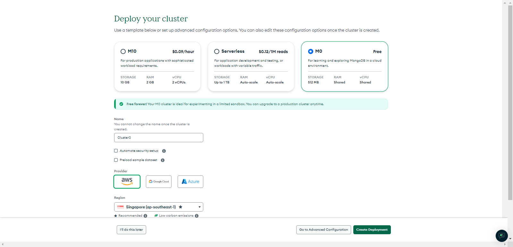

Region : Singapore (ap-southeast-1)

Click to Button >> Create Deployment

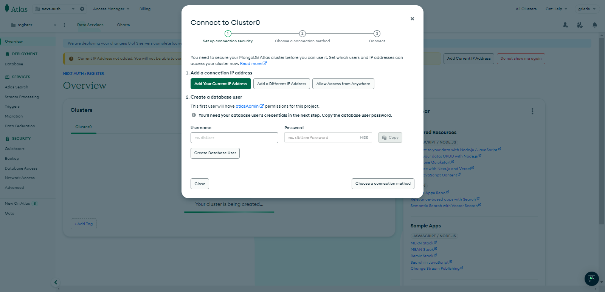

Click >> Allow Access from Anyware

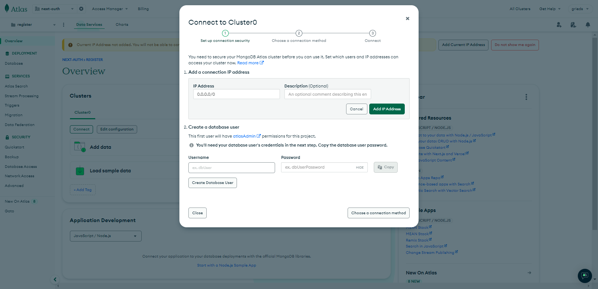

Click to Button >> Add IP Address

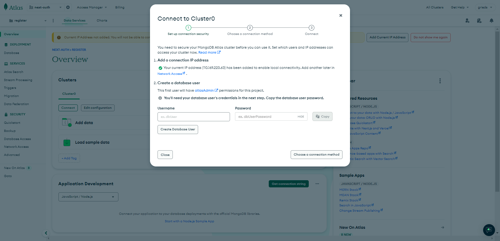

- username : for you
- passeord : for you

Click to Button >> Create Database User

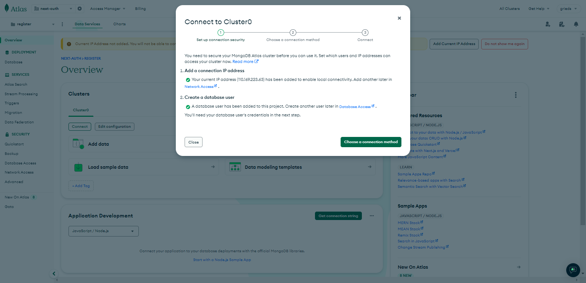

Click to Button >> Connect to Cluster

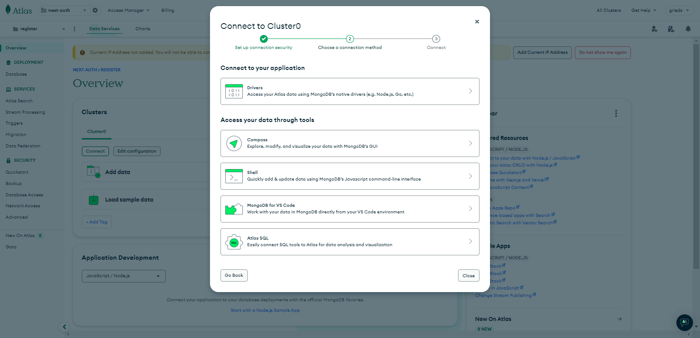

Click to Button >> MongoDB for VS Code

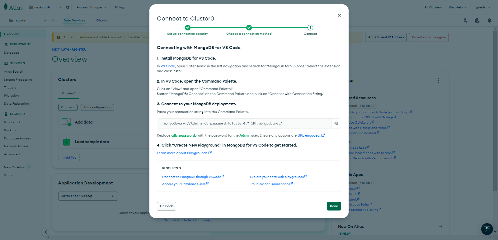

Copy :

`mongodb+srv://Admin:<db_password>@cluster0.7f15f.mongodb.net/`

Click to Button >> Done

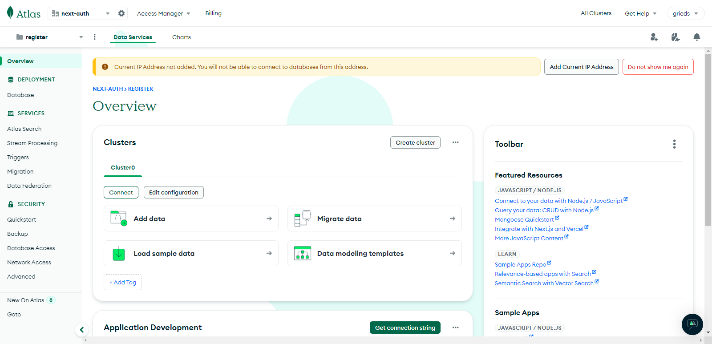

Go to Project on VS Code

Create a new file `root/.evn`

~~~evn
MONGODB_URI=mongodb+srv://Admin:<db_password>@cluster0.7f15f.mongodb.net/
~~~

Chang `<db_password>` for your password

Save and close

Verify Environment Variable Loading :

Make sure you are loading environment variables from your `.env` file. You likely need the `dotenv` package :

~~~bash
npm install dotenv
~~~

Edit file `root/.gitignore`

~~~.gitignore
// ... rest code

# local env files
.env*.local
.env

// ... rest code
~~~

Save and close

[Next Step >>](step5.md)
